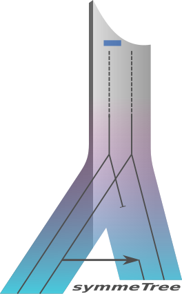

# AsymmeTree

AsymmeTree is an open-source Python library for the simulation and analysis of phylogenetic scenarios.
It includes a simulator for species and gene trees with heterogeneous evolution rates, nucleotide and amino acid sequences with or without indels, as well as whole genomes/proteomes.

Moreover, it includes tools for the inference and analysis of orthology and phylogenetic best matches (resp. best hits) from known gene trees or evolutionary distances, tools for the analysis of horizontal gene transfer (HGT) events, an algorithm to compute supertrees, and a method to estimate rooted species trees from an ensemble of orthology/paralogy relations.

The library is primarily designed to explore and validate mathematical concepts, and to test inference methods for various steps on the way to more realistically-available data, i.e., dated gene trees, additive distances of gene sets, noisy distances and finally sequences.

## Installation

AsymmeTree requires Python 3.5 or higher.

#### Easy Installation with pip

The `asymmetree` package is available on PyPI:

    pip install asymmetree

For details about how to install Python packages see [here](https://packaging.python.org/tutorials/installing-packages/).
    
#### Dependencies

AsymmeTree has several dependencies (which are installed automatically when using `pip`):
* [NetworkX](https://networkx.github.io/)
* [Scipy and Numpy](http://www.scipy.org/install.html)
* [Matplotlib](https://matplotlib.org/)

The simulation of phylogenetic scenarios and sequences, as well as most functions for their analysis, do not have any other dependencies.
However, to use the tree reconstruction method for best match inference and the C++ implementation of the quartet method, resp., [RapidNJ](https://birc.au.dk/software/rapidnj/) and [qinfer](https://github.com/david-schaller/qinfer) must be installed.
I recommend that you compile these tools on your machine, place the binaries into a persistent location and add this location to your PATH environment variable.

## Usage and Description

For a more detailed description of the usage and the implementation of the simulator please read the [manual](https://github.com/david-schaller/AsymmeTree/blob/master/manual/AsymmeTreeManual.pdf).

### Tree Data Structures

The two classes `Tree` and `PhyloTree` implement tree data structures which are essential for most of the modules in the package.
The latter contains converters and parsers for the Newick format and a NetworkX graph format.
Moreover, `PhyloTree` can be serialized in either JSON format or the Python-specific serialization format (using the library `pickle`).

### Simulation of Phylogenetic Trees

The subpackage `treeevolve` contains modules for the simulation and manipulation of species trees and gene trees.

A typical simulation consists of the following steps:
* dated species tree (models e.g. 'innovation', 'Yule' and '(episodic) birth-death process')
* dated gene tree(s) (birth-death process with speciations as additional branching events)
* assignment of asymmetric evolution rates to paralogous genes
* observable gene tree(s) (removal of all branches that lead to losses only)

The resulting gene trees have edge lengths (`dist`) that correspond to product of the divergence time between the respective nodes and the evolutionary rates that were assigned to them.
Such a tree defines a distance matrix on its set of leaves (more precisely, an additive metric).
Noise can be added to this matrix by several methods.
Alternatively, sequences can be simulated along the tree, from which distances can be reestimated.

### Simulation of Sequences

The subpackage `seqevolve` contains modules for the simulation of nucleotide or amino acid sequences along a phylogenetic tree.
The substitution of sites is modeled by continuous-time Markov chains.
These models typically take a substitution-rate matrix and the equilibrium frequencies of the states (i.e. the nucleotides or amino acids as input).
Moreover, insertions and deletions (indels) and heterogeneity among the sites can be simulated.

A typical simulation therefore is run with the following components (only the substitution model is mandatory):
* substitution model (model for nucleotidess e.g. 'JC69', 'K80', 'GTR'; for amino acids 'DAYHOFF', 'BLOSUM62', 'JTT', 'WAG', 'LG')
* indel model (based on the tool 'Dawg' by Cartwright 2005)
* heterogeneity model (constant / sitewise / number of classes; proportion of invariant sites)

Functions for outputting the true alignment are provided for several formats incl. phylip and clustal.

### Simulation of Genomes

The module `genome.GenomeSimulation` provides functions that combine the simulation of phylogenetic trees and sequences.
This way, whole genomes/proteomes can be simulated conveniently.
The (optional) output directory contains serialized trees, fasta files and the true alignments.

### Best Match Inference

Phylogenetic best matches of a gene x of species X are defined as those genes y of another species Y that share the lowest common ancestor with x in the gene tree among all genes in that species. In contrast, two genes are orthologs if their last common ancestor was a speciation event. Orthology and reciprocal best matches are closely related.

The subpackage `best_matches` contains functions to compute both relations.
If the true (observable) gene tree is known (as e.g. the case in simulations), best matches and orthologs can be computed using the module `TrueBMG`. If only distance data is available, best matches have to be estimated (from distance data on a set of genes). AsymmeTree currently implements three different methods that are described by Stadler et al. (2020).

### HGT Analysis

The subpackage `hgt` contains several functions for the analysis of horizontal gene transfer events in the simulated scenarios. In particular, the directed and undirected Fitch graph can be extracted, as well as the pairs of genes that diverged later than the respective species in which they reside, i.e. the so-called later-divergence-time (LDT) graph. The latter situation is indicative for the presence of HGT events in the scenario.

### Supertree Computation

Implementation of the BuildST algorithm described by Deng & Fernández-Baca (2016) to compute a supertree from a given list of tree based on the leaf labels. The algorithm uses the dynamic graph data structure described by Holm, de Lichtenberg & Thorup in 2001 (HDT algorithm). The classes `HDTGraph` and `BuildST` can be imported from the subpackages `datastructures` and `tools`, respectively.

### Cograph Editing and ParaPhylo

The subpackages `cograph` and `paraphylo` contain heuristics for cograph editing and a method to compute rooted species tree from orthology/paralogy relations.
The latter is a reimplementation of [ParaPhylo](http://pacosy.informatik.uni-leipzig.de/208-0-ParaPhylo.html) which uses heuristics for the NP-hard steps instead of exact ILP solutions.

## Citation and References

If you use AsymmeTree in your project or code from it, please cite:

* **Stadler, P. F., Geiß, M., Schaller, D., López Sánchez, A., González Laffitte, M., Valdivia, D., Hellmuth, M., and Hernández Rosales, M. (2020) From pairs of most similar sequences to phylogenetic best matches. Algorithms for Molecular Biology. doi: 10.1186/s13015-020-00165-2.**

For references to concepts and algorithms that were implemented please see the [manual](https://github.com/david-schaller/AsymmeTree/blob/master/manual/AsymmeTreeManual.pdf).

Please report any bugs and questions in the [Issues](https://github.com/david-schaller/AsymmeTree/issues) section.
Also, feel free to make suggestions for improvement and/or new functionalities.