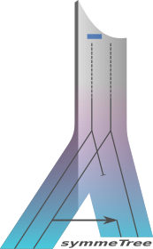

# AsymmeTree

AsymmeTree is an open-source Python library for the simulation and analysis of phylogenetic scenarios.
It includes a simulator for species and gene trees with heterogeneous evolution rates, nucleotide and amino acid sequences with or without indels, as well as whole genomes/proteomes.

Moreover, it includes a matplotlib-based visualization of the simulated trees as well as tools for the extraction of information from the simulated scenarios such as orthology, best matches, and xenology.

The library is primarily designed to explore and validate mathematical concepts, and to test inference methods for various steps on the way to more realistically-available data, i.e., dated gene trees, additive distances of gene sets, noisy distances and finally sequences.

## Installation

AsymmeTree requires Python 3.7 or higher.

#### Easy installation with pip

The `asymmetree` package is available on PyPI:

    pip install asymmetree

For details about how to install Python packages see [here](https://packaging.python.org/tutorials/installing-packages/).

#### Installation with the setup file

Alternatively, you can download or clone the repo, go to the root folder of package and install it using the command:

    python setup.py install

#### Dependencies

AsymmeTree has several dependencies (which are installed automatically when using `pip`):
* [NetworkX](https://networkx.github.io/)
* [Scipy and Numpy](http://www.scipy.org/install.html)
* [Matplotlib](https://matplotlib.org/)
* [tralda](https://github.com/david-schaller/tralda)

## Usage and description

A user manual with example code can be found in the [Wiki](https://github.com/david-schaller/AsymmeTree/wiki/Manual).
AsymmeTree is divided into several subpackages and modules, see also the following [documentation](https://david-schaller.github.io/docs/asymmetree/) generated from the source code.

## Citation

If you use AsymmeTree in your project or code from it, please consider citing:

* **Stadler, P. F., Geiß, M., Schaller, D., López Sánchez, A., González Laffitte, M., Valdivia, D., Hellmuth, M., and Hernández Rosales, M. (2020) From pairs of most similar sequences to phylogenetic best matches. Algorithms for Molecular Biology. doi: 10.1186/s13015-020-00165-2.**

Please report any bugs and questions in the [Issues](https://github.com/david-schaller/AsymmeTree/issues) section.
Also, feel free to make suggestions for improvement and/or new functionalities.
