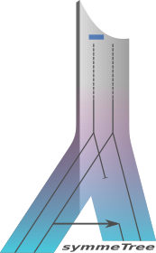

# AsymmeTree

AsymmeTree is an open-source Python library for the simulation and analysis of phylogenetic scenarios.
It includes a simulator for species and gene trees with heterogeneous evolution rates, nucleotide and amino acid sequences with or without indels, as well as whole genomes/proteomes.

Moreover, it includes tools for the extraction of information from the simulated scenarios such as orthology, best matches, and xenology, and a method to estimate rooted species trees from an ensemble of orthology/paralogy relations.

The library is primarily designed to explore and validate mathematical concepts, and to test inference methods for various steps on the way to more realistically-available data, i.e., dated gene trees, additive distances of gene sets, noisy distances and finally sequences.

## Installation

AsymmeTree requires Python 3.7 or higher.

#### Easy installation with pip

The `asymmetree` package is available on PyPI:

    pip install asymmetree

For details about how to install Python packages see [here](https://packaging.python.org/tutorials/installing-packages/).

#### Installation with the setup file

Alternatively, you can download or clone the repo, go to the root folder of package and install it using the command:

    python setup.py install

#### Dependencies

AsymmeTree has several dependencies (which are installed automatically when using `pip`):
* [NetworkX](https://networkx.github.io/)
* [Scipy and Numpy](http://www.scipy.org/install.html)
* [Matplotlib](https://matplotlib.org/)
* [tralda](https://github.com/david-schaller/tralda)

## Usage and description

AsymmeTree is divided into several subpackages and modules, an overview of
which is given below.
The package uses many classes and functions from the
[tralda](https://github.com/david-schaller/tralda) library for
**tr**ee **al**gorithms and **da**ta structures.
The API functions are described in the following sections and can be imported
directly from the respective subpackage (see examples).

The term `color` regularly appears in the library and refers to the reconciliation of gene trees with species trees.
In particular, the terms `color` and species/genome in which a gene resides are used interchangeably.

### Tree data structures

The class `Tree` in [tralda](https://github.com/david-schaller/tralda) implements a tree data structure which is essential for most of the modules in the package.

The nodes in the simulated trees have attributes: (Click to expand)

| Attribute | Description and type |
| --- | ----------- |
| `label` | node label, usually `int` |
| `event` | the type of the event, in gene trees: 'S' for speciation, 'D' for duplication, 'H' for horizontal gene transfer, 'L' for loss, `str` |
| `color` | only gene trees; species in which the gene resides, i.e., `label` of some vertex in a species tree, `int` for extant genes, can be of type `tuple` (of two `int`s) for inner and loss vertices |
| `tstamp` | time stamp of the event (`double`) |
| `dist` | evolutionary distance from the parent vertex (`double`); if no evolution rates (see below) were simulated yet, then this value corresponds to the divergence time between the vertex and its parent |
| `transferred` | only gene trees; indicates whether the edge from the parent is the transfer edge from an HGT event; `1` if this is the case and `0` otherwise |

All simulated trees can be serialized in either JSON format or the Python-specific serialization format (using the library `pickle`).
By default, the serialization format is inferred from the file extension.
Alternatively, it can be specified as keyword argument, e.g. `mode='json'`.

Example usage: (Click to expand)

    from tralda.datastructures import Tree

    # T is of type 'Tree'
    T.serialize('path/to/tree.pickle')
    # or
    T.serialize('path/to/tree.json')

    # reload serialized tree
    T_from_file = Tree.serialize('path/to/tree.some_file_ext', mode='json')

Moreover, the module `asymmetree.tools.PhyloTreeTools` provides the functions `to_newick()` and `parse_newick()` for converting and parsing trees to and from Newick format, respectively.
In case of a gene tree, the color is represented in brackets, e.g. '(3<1>:0.534,2<2>:0.762)1<0>:0.273'.
To suppress this, use `to_newick(color=False)`. Likewise, to suppress the distances, you can use `to_newick(distance=False)`.
The function `parse_newick()` can handle this customized format as well as the standard Newick format.

### Simulation of phylogenetic trees

The subpackage `asymmetree.treeevolve` contains modules for the simulation and manipulation of species trees and gene trees.
In terms of divergence time, these trees define an ultrametric on the set of their (extant) leaves.
Gene trees, furthermore, can be manipulated with a realistic rate heterogeneity among their branches resulting in general additive distances (but no longer ultrametric).

A typical simulation consists of the following steps:
* dated species tree (models e.g. 'innovation', 'Yule', and '(episodic) birth-death process')
* dated gene tree(s) (birth-death process with speciations as additional branching events)
* assignment of asymmetric evolution rates to paralogous genes
* observable gene tree(s) (removal of all branches that lead to losses only)

The resulting gene trees have edge lengths (`dist`) that correspond to the product of the divergence time between the respective nodes and the evolutionary rates that were assigned to them.
Such a tree defines a distance matrix on its set of leaves (more precisely, an additive metric).
Noise can be added to this matrix by several methods.
Alternatively, sequences can be simulated along the tree, from which distances can be reestimated.

Example usage: (Click to expand)

    import asymmetree.treeevolve as te
    from asymmetree.tools.PhyloTreeTools import to_newick

    # simulate and species tree with 10 leaves
    S = te.simulate_species_tree(10, planted=True, non_binary_prob=0.2)

    # simulate a gene tree along the species tree S
    T = simulate_dated_gene_tree(S, dupl_rate=D, loss_rate=L, hgt_rate=H,
                                   prohibit_extinction='per_species')

    # simulate evolution rates for the  branches in the gene tree
    # and update the distances in T accordingly
    T = te.assign_rates(T, S, base_rate=1,
                        autocorr_variance=0.2,
                        rate_increase=('gamma', 0.5, 2.2))

    # remove all gene loss branches
    T = te.observable_tree(TGT)

    # print the resulting tree in Newick format and save it to file
    print(to_newick(T))
    T.serialize('path/to/file.json')

#### Species trees

The function `simulate_species_tree(N)` simulates a dated species tree with `N` leaves (i.e. recent species) using the specified model.

The following models are available: (Click to expand)

| Model | Description |
| --- | ----------- |
| `'innovation'` | Innovation model (Keller-Schmidt & Klemm 2012), if not specified the divergence time between the (planted) root and the leaves will be normalized to unity |
| `'yule'` | standard Yule model (Yule 1924), default birth rate is 1.0 |
| `'BDP'` | constant-rate birth-death process (Kendall 1948, Hagen & Stadler 2018), default birth rate is 1.0 and death rate is 0.0 |
| `'EBDP'` | episodic birth-death process, algorithm of (Stadler 2011) |

The following keyword parameters are available: (Click to expand)

| Parameter (with default value) | Description |
| --- | ----------- |
| `model='innovation'` | model for the species tree simulation |
| `birthrate=1.0` | birth rate, only relevant for models `'yule'` and `'BDP'` |
| `deathrate=1.0` | death rate, only relevant for model `'BDP'` |
| `episodes=None` | episodes for episodic birth-death process, only relevant for `'EBDP'`, the episodes of the `'EBDP'` model must be supplied as a list of tuples/lists where each episode has the structure `(birthrate, deathrate, proportion_of_survivors, time_stamp)`, the first elements in this list correspond to the most recent ones, i.e., the first episode should have a time stamp of 0.0. |
| `non_binary_prop=0.0` | probability that an inner edge is contracted, results in a non-binary tree |
| `planted=True` | add a planted root that has the first true speciation node as its single neighbor, this way duplication (and loss) events can occur before the first speciation event in a subsequent gene tree simulation |
| `remove_extinct=False` | remove all branches leading to losses, only relevant for models with death events |
| `rescale_to_height=None` | specify the divergence time between the (planted) root and the leaves i.e. the final height of the dated tree |

For any model, the root of the resulting tree has the maximal time stamp and all (extant) species have time stamp 0.0.

Example usage: (Click to expand)

    import asymmetree.treeevolve as te

    S1 = te.simulate_species_tree(10, planted=True, non_binary_prob=0.2)
    print(S1.to_newick())

    S2 = te.simulate_species_tree(10, model='EBDP',
                                  episodes=[(1.0, 0.3, 0.8, 0.0),
                                            (0.9, 0.4, 0.6, 0.3)])
    print(S2.to_newick())

#### Gene trees

Dated gene trees are simulated along a given species tree `S` using a birth-death process (Kendall 1948, Gillespie 1976) with speciation events as additional branching events (fixed time points given by the species tree). At each time point, the total event rate is given by the sum of the event rates over all branches that are currently active (not extinct).
Thus, the total event rate in general increases during the simulation if the loss rate does not dominate the rates of the branching events.
To simulate gene tree, use the class `GeneTreeSimulator` or the function
`simulate_dated_gene_tree(S, **kwargs)` with a species tree of type `Tree`.

The following keyword parameters are available: (Click to expand)

| Parameter (with default value) | Description and type |
| --- | ----------- |
| `dupl_rate=0.0` | duplication rate (`float`) |
| `loss_rate=0.0` | loss rate (`float`) |
| `hgt_rate=0.0` | horizontal gene transfer rate rate (`float`) |
| `dupl_polytomy=0.0` | allows non-binary duplication events by drawing a number from a Poisson distribution with rate parameter `dupl_polytomy` (copy number = 2 + drawn number) (`float`) |
| `prohibit_extinction='per_species'` | avoid loss events for genes that are the last survivor in their species branch (`'per_species'`), the last survivor of the whole family (`'per_family'`); or no constraints  (`False`) |
| `replace_prob=0.0` | probability that a a transferred copy replaces one (randomly chosen) homolog in the receiving branch; default is `0.0` in which case all HGT events are additive (`float`) |

For the constraints to avoid extinction, the loss rates in the respective branches are temporarily set to zero.
Note that if replacing HGT is enabled (`replace_prob` >0.0), then the resulting tree may contain loss leaves even if the loss rate is zero since replacement is modeled by a loss of a paralog.
Hence, constructing the observable tree (see below) also becomes relevant in
the latter setting.

The function `observable_tree(tree)` returns the observable part of a gene tree, i.e., it copies the tree, removes all branches that lead to loss events only and suppresses all inner nodes with only one child.
It also removes the planted root.

Example usage: (Click to expand)

    import asymmetree.treeevolve as te

    # S is a species tree of type Tree
    tree_simulator = te.GeneTreeSimulator(S)
    tree = tree_simulator.simulate(dupl_rate=1.0, loss_rate=0.5, hgt_rate=0.1)

    # or
    tree = te.simulate_dated_gene_tree(S,
                                       dupl_rate=1.0,
                                       loss_rate=0.5,
                                       hgt_rate=0.1,
                                       replace_prob=0.5)

    # observable gene tree
    ogt = te.observable_tree(tree)

#### Assignment of variable evolution rates

The module `EvolutionRates` contains functions to model realistic (asymmetric) evolution rates for a given gene tree.
Moreover, correlation of the evolution rates between genes of the same (and closely related) species is introduced (autocorrelation, Kishino 2001).
The function `assign_rates(T, S)` takes a gene tree `T` and the **corresponding** species tree `S` as input, and manipulates the branch length of the gene tree.

The following keyword parameters are available: (Click to expand)

| Parameter (with default value) | Description and type |
| --- | ----------- |
| `base_rate=1.0` | starting value for the substitution rate (per time unit) and expected value for conserved genes (`float`) |
| `autocorr_factors=None` | a `dict` containing rate factors for the edges of the species tree |
| `autocorr_variance=0.0` | variance factor for a lognormal distribution that controls autocorrelation between genes of the same (and closely related) species, the higher the lower the autocorrelation; only relevant if `autocorr_factors` is not directly supplied (`float`) |
| `rate_increase=('gamma', 0.5, 2.2)` | distribution of the (relative) rate increase (w.r.t. the base rate) for divergent genes, i.e. to a factor 1 + x, the parameters the for default Gamma distribution are chosen to fit observed asymmetries between paralogs in yeast data (Byrne et al. 2007), (`tuple`) |
| `CSN_weights=(1, 1, 1)` | weights for choice between conservation, subfunctionalization, and neofunctionalization after a duplication event (`tuple` of three `int`/`float`s) |
| `inplace=True` | manipulate edge lengths (`dist`) of the gene tree in-place, otherwise copy the tree |

It is recommended to apply the rate assignment to the true gene tree that still contains loss events.
Note that the rates are used to manipulate the `dist` attributes in the gene tree and not returned explicitly.

The function `simulate_gene_trees(S)` combines the simulation of dated gene trees and the rate assignment into one step.
If `N=1`, a single gene tree is returned.
Otherwise, a `list` of gene trees is returned that shared the same rate factors for the branches in the species tree (autocorrelation factors) in the rate assignment procedure.
Moreover, a distribution for the base rate (assigned the planted edge of the gene tree) and for the event rates can be specified with the parameters `base_rate`, `dupl_rate`, `loss_rate`, and `hgt_rate`.
For available distributions and their syntax see below.

Example usage: (Click to expand)

    import asymmetree.treeevolve as te

    S = te.simulate_species_tree(10)

    # true gene tree (with losses)
    tree = te.simulate_dated_gene_tree(S, dupl_rate=1.0, loss_rate=0.5, hgt_rate=0.1)
    te.assign_rates(tree, S, base_rate=1,
                    autocorr_variance=0.2,
                    rate_increase=('gamma', 0.5, 2.2))

    # or in a single step
    tree = simulate_gene_trees(S, N=1,
                               dupl_rate=('gamma', 1.0, 0.8),   # distribution
                               loss_rate=0.5,                   # or constant value
                               hgt_rate=0.1,
                               base_rate=('constant', 1.0),
                               autocorr_variance=0.2,
                               rate_increase=('gamma', 0.5, 2.2))

    # observable gene tree
    ogt = te.observable_tree(tree)

#### Distance Matrix and Noise

Distances derived from (real-life) gene or protein sequences are burdened with noise.
Such data can either be modeled by simulating sequences, or by disturbing the distances specified by a given tree directly.

The latter alternative is described briefly in this section. (Click to expand)

The additive (i.e., noiseless) distance from an **observable** gene tree can be computed using the function `distance_matrix(tree)` from `asymmetree.tools.PhyloTreeTools`.
It returns a tuple containing a list of leaves in the tree (corresponding to the row/column order) and the distance matrix as a 2-dimensional `numpy` array.

    # tree is an observable gene tree
    leaves, D = tree.distance_matrix()
    leaf_index_dict = {leaf: i for i, leaf in enumerate(leaves)}

In the next step, noise can be introduced into a distance matrix using the `asymmetree.treeevolve.NoisyMatrix` module.
Random noise can be simulated with the function `noisy_matrix(orig_matrix, sd)`.

The following keyword parameters are available:

| Parameter (with default value) | Description and type |
| --- | ----------- |
| `orig_matrix` | matrix to be disturbed (2-dimensional `numpy` array) |
| `sd` | standard deviation of a normal distribution with mean 1 from which noise factors are drawn (`float`) |
| `metric_repair='reject'` | method to ensure that the resulting distance matrix is still a metric, available are the rejection of noise steps that violate the metric property (`'reject'`), the decrease-only metric repair (`'DOMR'`) and the general metric repair (`'general'`) algorithm |

Alternatively, the function `convex_linear_comb(D1, D2)` can be used to simulate systematically biased noise by computing a linear convex combination with a disturbance matrix.
The function thus takes two distance matrices (`numpy` arrays) not necessarily of the same size as input and disturbs them with one another.
The contribution of the respective disturbance matrix is controlled by the keyword parameter `alpha` (default is `0.5`).
If the keyword parameter `first_only` is `True`, only the first disturbed matrix is returned.
Otherwise, both are returned in a `tuple`.

### Simulation of sequences

The subpackage `asymmetree.seqevolve` contains modules for the simulation of nucleotide or amino acid sequences along a phylogenetic tree using time-continuous Markov chains, as usually applied for this purpose (for textbooks, see e.g. Felsenstein 2004, Yang 2006, Yang 2014).

These models typically take a substitution-rate matrix and the equilibrium frequencies of the states (i.e. the nucleotides or amino acids as input).
Moreover, insertions and deletions (indels) and heterogeneity among the sites can be simulated.

A typical simulation therefore is run with the following components: (Click to expand)

* substitution model (mandatory; model for nucleotidess e.g. 'JC69', 'K80', 'GTR'; for amino acids 'DAYHOFF', 'BLOSUM62', 'JTT', 'WAG', 'LG')
* indel model (based on the tool 'Dawg' by Cartwright 2005)
* heterogeneity model (constant / sitewise / number of classes; proportion of invariant sites)

Accordingly, the class `Evolver` in `asymmetree.seqevolve.Evolver` requires the parameter `subst_model` for its initialization, and has optional parameter `indel_model` and `het_model`.

Functions for outputting the true alignment are provided for several formats including phylip and clustal.

Example usage: (Click to expand)

    from tralda.datastructures import Tree
    import asymmetree.seqevolve as se

    T = Tree.load('path/to/file.json')

    # specify models
    subst_model = se.SubstModel('a', 'JTT')
    indel_model = se.IndelModel(0.01, 0.01, length_distr=('zipf', 1.821))

    # initialize Evolver instance
    evolver = se.Evolver(subst_model, indel_model=indel_model)

    # simulate sequences along the tree
    evolver.evolve_along_tree(T, start_length=150)

    # print the node labels and the corresponding sequences
    for node, sequence in evolver.sequences.items():
        print(node.label, subst_model.to_sequence(sequence))

    # construct the true alignment (sequences with gaps) and write it to file
    evolver.true_alignment(write_to='path/to/aligment.phylip',
                           alignment_format='phylip')

#### Substitution model

A substitution model usually comprises an exchangeability matrix S and a vector π containing the equilibrium frequencies of the alphabet A of nucleobases, amino acids et cetera.
From this, the rate matrix Q can be computed as SΠ where Π=diag(π1,...,π|A|) (Yang 2006).
The substitution probability matrix, in turn, is given by P=eQt which is computed efficiently by AsymmeTree using matrix diagonalization.

The following models are available: (Click to expand)

Nucleotide models: `'n'`, amino acid models: `'a'`, codon models are not supported at the moment

| Model | Type | Reference | required parameters (`kwargs`) |
| --- | --- | --- | --- |
| `'JC69'` | `'n'`/`'a'` | Jukes & Cantor 1969 |  |
| `'K80'` | `'n'` | Kimura 1980 | `kappa` (transition/transversion rate ratio) |
| `'GTR'` | `'n'` | general time-reversable model (GTR), Tavare 1986 | `abcdef` (list of rates (a) C&#8596;T, (b) A&#8596;T, (c) G&#8596;T, (d) A&#8596;C, (e) C&#8596;G, (f) A&#8596;G); `f` (list of equilibrium frequencies A/C/G/T) |
| `'DAYHOFF'` | `'a'` | Dayhoff 1978 |  |
| `'BLOSUM62'` | `'a'` | BLOSUM62, Henikoff 1992 |  |
| `'JTT'` | `'a'` | Jones, Taylor & Thornton 1992 |  |
| `'WAG'` | `'a'` | Whelan & Goldman 2001 |  |
| `'LG'` | `'a'` | Le & Gascuel 2008 |  |
| `'CUSTOM'` | `'n'`/`'a'` |  | `filename` (path to a file with a model in PAML format) |

Note that a custom substitution model can be specified via `model_name='CUSTOM'`.
In this case, the path to the model in PAML (Yang 1997) format must be supplied.
Moreover, the model type (`'n'`/`'a'`) must fit this model.

Example usage: (Click to expand)

    from asymmetree.seqevolve import SubstModel

    # non-empirical model
    subst_model_jc69 = SubstModel('n', 'K80', kappa=2.0)

    # empirical model
    subst_model_jtt = SubstModel('a', 'JTT')

    # custom model
    subst_model_custom = SubstModel('a', 'CUSTOM', filename='path/to/custom.paml')

#### Indel model

Insertions and deletions are modeled as in `Dawg` (Cartwright 2005).
An indel model requires sitewise rates for insertion `insertion_rate` and deletion `deletion_rate`.

The following keyword parameters are available: (Click to expand)

| Parameter (with default value) | Description and type |
| --- | ----------- |
| `length_distr=('zipf', 1.821)` | distribution of indel length, the default value is a Zipf distribution with empirically observed parameters (Chang 2004)  |
| `min_length=1` | `int` minimal value at which the specified distribution is truncated, must be less than the expected value of the distribution, `None` means no limit  |
| `max_length=None` | `int` maximal value at which the specified distribution is truncated, must be greater than the expected value of the distribution, `None` means no limit  |

For available length distributions and their syntax see below.
A zipf or negative binomial distribution are typically used for this purpose (Cartwright 2005, Dalquen 2012).

Example usage: (Click to expand)

    from asymmetree.seqevolve import IndelModel

    # sitewise insertion rate 0.01 and deletion rate 0.008
    indel_model = IndelModel(0.01, 0.008, length_distr=('zipf', 2.0))

#### Heterogeneity model

Selective pressure usually varies among the sites of a sequence under evolution.
To model this, rate factors r for single sites or groups of sites are commonly drawn from a Gamma distribution (+Γ) with mean 1 and parameter α (Cartwright 2005, Fletcher 2009, Dalquen 2012).
The rate matrix rQ is then used instead of Q.
Note that smaller values for α correspond to higher heterogeneity.

AsymmeTree supports two modes of the +Γ-model.
You can specify a number of classes to which the sites are assigned randomly and uniformly distributed.
Sites of the same class share a common factor r.
The other possibility is a sitewise heterogeneity, i.e., every site has its own rate.
In both cases, the rate or class membership is inherited from the parent sites during the evolution along a tree.
Note that the sitewise mode is expected to have a longer running time.

An other aspect of among site heterogeneity is the modeling of invariant sites (+I), i.e., sites that never mutate at all as a result of very strong selective pressure.
The (expected) proportion p of invariant sites can be specified by the user,
and sites are assigned as `'invariant'` with probability p.
Note that p>0 affects the overall substitution rate.
In other words, the rates of the non-invariant sites are **not** adjusted to compensate the decreased number of expected substitution over all sites.

The following keyword parameters are available: (Click to expand)

| Parameter (with default value) | Description and type |
| --- | ----------- |
| `alpha` | parameter α of the Gamma distribution (`float`) |
| `classes=5` | number of classes; sites in the same class share the same rate factor (`int`) |
| `sitewise=False` | if `True`, factors are drawn sitewise; the number of classes is ignored in this case (`bool`) |
| `invariant=0.0` | (expected) proportion of invariant sites (`float`) |

Note that the +I-model can be used without the +Γ-model by setting `classes=1` (the single class will have a factor of 1) and `'invariant'` to some proportion greater than 0.

Example usage: (Click to expand)

    from asymmetree.seqevolve import HetModel

    # +G
    het_model_g  = HetModel(1.5, classes=10)

    # +G +I
    het_model_gi = HetModel(2.0, sitewise=True, invariant=0.2)

    # +I (value of alpha is irrelevant)
    het_model_i  = HetModel(1.0, classes=1, invariant=0.25)

#### The class Evolver

The class `Evolver` in the module `asymmetree.seqevolve.Evolver` evolves a sequence according to the specified models (see previous sections) along a phylogenetic tree.
In AsymmeTree, the `dist` attribute of the vertex v in an edge uv of the tree (u is closer to the root) is always used as the **expected number of substitutions** along this edge.
Thus, PAM distances as e.g. used optionally in `ALF` (Dalquen 2012) are not supported.
The `dist` attribute is also used as the duration of the Markov process in which insertions and deletions are drawn.

The following parameters are available for initialization: (Click to expand)

| Parameter (with default value) | Description and type |
| --- | ----------- |
| `subst_model` | substitution model (`SubstModel`) |
| `indel_model=None` | model for insertions and deletions (`IndelModel`) |
| `het_model=None` | model for among site heterogeneity and invariant sites (`HetModel`) |
| `jump_chain=False` | if `True`, an alternative Gillespie-like (Gillespie 1976) algorithm is applied for the substitution process instead of the computation of P=eQt (`bool`) |

Once the `Evolver` is initialized, its function `evolve_along_tree(tree)` can be called to evolve a sequence along a tree.

The following parameters are available for this function: (Click to expand)

| Parameter (with default value) | Description and type |
| --- | ----------- |
| `tree` | phylogenetic tree with `dist` attributes set (`Tree`) |
| `start_length=200` | length of the root sequence which is randomly drawn from the equilibrium frequencies in the specified substitution model (`int`) |
| `start_seq=None` | root sequence; must be compatible with the specified substitution model (`model_type='n'`/`'a'`); if supplied, the `start_length` attribute is ignored (`str`) |

The sequences of a simulation run are returned by this function (and also available via the attribute `sequences` as long as the function has not been called again), which is a `dict` containing the nodes (inner and leaf nodes) as keys and instances of type `EvoSeq` as values.
The latter can be converted into `str` using `subst_model.to_sequence(evo_seq)`.

The function `true_alignment()` can be used to compute (and optionally write into a file) the 'true' alignment of a simulation run.

The following parameters are available for this function: (Click to expand)

| Parameter (with default value) | Description and type |
| --- | ----------- |
| `include_inner=True` | if `True`, include also inner nodes in the alignment; otherwise only sequences of leaf nodes are aligned (`bool`) |
| `write_to=None` | path and filename for the output (`str`) |
| `alignment_format='phylip'` | format of the alignment file; available are `'phylip'`, `'clustal'`, and `'pretty'` (`str`) |

Example usage: (Click to expand)

    from asymmetree.seqevolve import Evolver, SubstModel, IndelModel, HetModel

    # specify models (only 'SubstModel' is mandatory)
    subst_model = SubstModel('a', 'WAG')
    indel_model = IndelModel(0.01, 0.01, length_distr=('zipf', 1.821))
    het_model  = HetModel(2.0, classes=7, invariant=0.1)

    # evolve sequences along a phylogenetic tree 'tree'
    evolver = Evolver(subst_model, indel_model=indel_model, het_model=het_model)
    evolver.evolve_along_tree(tree, start_length=150)

    # print resulting sequences
    for node, evo_seq in evolver.sequences.items():
    print(node.label, subst_model.to_sequence(evo_seq))

    # output true alignment
    evolver.true_alignment(write_to='path/to/alignment.phylip',
                           alignment_format='phylip')

### Simulation of genomes

The module `asymmetree.genome.GenomeSimulation` provides functions that combine the simulation of phylogenetic trees and sequences.
In particular, the class `GenomeSimulator` combines multiple steps described in the previous sections in order to conveniently simulate whole genomes/proteomes.
The (optional) output directory contains serialized trees, fasta files, and the true alignments.
The gene trees and the sequences are simulated in subsequent steps using the classes' functions
(i) `simulate_gene_trees(N, **kwargs)` and (ii) `simulate_sequences(subst_model, **kwargs)`.

Details: (Click to expand)

The first step (i) takes the same keyword parameters as input as the function `simulate_gene_trees()` where `N` is the number of gene families to be simulated.
Thus, rates for the three event types (`dupl_rate`, `loss_rate`, `hgt_rate`), autocorrelation (`autocorr_variance`), the distribution of base rates (`base_rate_distr`) etc. can be specified.

The second step (ii) simulates the sequences along the observable part (without loss branches) of the simulated gene trees.
The function takes the following parameters as input:

| Parameter (with default value) | Description and type |
| --- | ----------- |
| `subst_model` | substitution model (`SubstModel`) |
| `indel_model=None` | model for insertions and deletions (`IndelModel`) |
| `het_model=None` | model for among site heterogeneity and invariant sites (`HetModel`) |
| `root_genome=None` | `list` of sequences for the roots of the gene trees; must contain the same number of `str` sequences as trees were simulated in step (i) i.e. `N`; sequences must be compatible with the specified substitution model (`model_type='n'`/`'a'`) |
| `length_distr=('constant', 200)` | distribution of the length of the root sequences if `root_genome` is not supplied; see below |
| `min_length=1` | `int` minimal value at which the specified distribution is truncated, must be less than the expected value of the distribution, `None` means no limit  |
| `max_length=None` | `int` maximal value at which the specified distribution is truncated, must be greater than the expected value of the distribution, `None` means no limit  |
| `write_fastas=True` | if `True `and an output directory was specified, write the `sequences` (one file **per species**) into the directory 'fasta_files' in the output directory (`bool`) |
| `write_alignments=True` | if `True` and an output directory was specified, write the true alignments (one file **per gene tree**) into the directory 'alignments' in the output directory (`bool`) |

After step (i), the `list`s of full and observable gene trees are accessible via the attributes `true_gene_trees` and `observable_gene_trees`, respectively.
Moreover, the full gene trees are serialized into the directory 'true_gene_trees' if an output directory was specified.
After step (ii), the `list`s of sequence `dict`s are accessible via the attribute `sequence_dicts`.

Example usage: (Click to expand)

    from asymmetree.treeevolve import simulate_species_tree
    from asymmetree.genome import GenomeSimulator
    from asymmetree.seqevolve import SubstModel, IndelModel

    # simulate the common species tree
    S = simulate_species_tree(10, model='innovation')

    # specify models for sequence evolution
    subst_model = SubstModel('a', 'JTT')
    indel_model = IndelModel(0.01, 0.01, length_distr=('zipf', 1.821))

    # initialy GenomeSimulator instance
    genome_sim = GenomeSimulator(S, outdir='simulation_directory')

    # simulate 50 gene trees along the species tree S (and write them to file)
    genome_sim.simulate_gene_trees(50, dupl_rate=1.0, loss_rate=0.5,
                                   base_rate=('gamma', 1.0, 1.0),
                                   prohibit_extinction='per_species')

    # simulate sequences along the gene trees
    genome_sim.simulate_sequences(subst_model,
                                  indel_model=indel_model,
                                  het_model=None,
                                  length_distr=('constant', 200))

    # results have been written to directories 'true_gene_trees',
    # 'fasta_files' and 'alignments' in 'path/to/genome_directory'

### Analysis of the simulated scenarios

The subpackage `asymmetree.analysis` contains various functions to extract information from the simulated scenarios.

Phylogenetic best matches of a gene x of species X are defined as those genes y of another species Y that share the lowest common ancestor with x in the gene tree among all genes in that species. In contrast, two genes are orthologs if their last common ancestor was a speciation event. Orthology and reciprocal best matches are closely related.
The module `asymmetree.analysis.BestMatches` contains methods for extracting BMGs from trees, least resolved trees of BMG, and orthology graphs from trees.

Example usage: (Click to expand)

    from asymmetree.analysis import orthology_from_tree, bmg_from_tree

    # tree is an observable gene tree
    orthology_graph = orthology_from_tree(tree)

    # best match graph and reciprocal best match graph as a tuple
    bmg, rbmg = bmg_from_tree(tree, supply_rbmg=True)

The module `asymmetree.analysis.HGT` contains several functions for the analysis of horizontal gene transfer events in the simulated scenarios. In particular, the directed and undirected Fitch graph can be extracted, as well as the pairs of genes that diverged later than the respective species in which they reside, i.e. the so-called later-divergence-time (LDT) graph. The latter situation is indicative for the presence of HGT events in the scenario.

Details and examples: (Click to expand)

An edge (u, v) in a gene tree is a 'true' transfer edge if an HGT event happened on the path from u to v. In the simulated trees, this is indicated by the attribute `transferred` of `TreeNode` v which is set to `1`.
An edge (u, v) in the gene tree is an **rs-**transfer edge (named after the relaxed scenario framework, Schaller et al. 2021) if the `color`s of u and v are incomparable in the corresponding species tree `S`.
True and rs-transfer edges may not be equivalent, e.g. when a transfer from branch A to B is followed by a transfer from B to A and this gene lineage does not survive in branch B.

    from asymmetree.hgt import true_transfer_edges, rs_transfer_edges

    # gene tree T and species tree S
    transfer_edges1 = true_transfer_edges(T)
    transfer_edges2 = rs_transfer_edges(T, S)

The directed Fitch graph of a tree T has as vertex set the leaves of T and a directed edge (x,y) when the path from the last common ancestor of x and y to the leaf y contains a transfer edge (Geiß et al. 2018).
The undirected Fitch graph of a tree T also has as vertex set the leaves of T and an undirected edge xy when the path from x to y contains a transfer edge (Hellmuth et al. 2018).

    from asymmetree.hgt import fitch, undirected_fitch

    # gene tree 'T', and precomputed 'transfer_edges'
    dfg = fitch(T, transfer_edges)
    ufg = undirected_fitch(T, transfer_edges)

As mentioned above, the situation in which two genes diverged later that their corresponding species witnesses HGT events.
The graph that contains edges for any such gene pair has been termed the later-divergence-time (LDT) graph.

    from asymmetree.hgt import ldt_graph

    # gene tree 'T', CORRESPONDING species tree 'S'
    ldt = ldt_graph(T, S, lca_T=None, lca_S=None)

In order to reduce runtime, precomputed instances of the class `LCA` (see [tralda](https://github.com/david-schaller/tralda)) for `T` and `S` can be supplied using the keyword parameters `lca_T` and `lca_S`, respectively. Otherwise, such instances are initiated within the function.

### Species trees from orthology

The subpackage `asymmetree.paraphylo` contains a method to compute rooted species tree from orthology/paralogy relations.
This is a reimplementation of [ParaPhylo](http://pacosy.informatik.uni-leipzig.de/208-0-ParaPhylo.html) which uses heuristics for the NP-hard optimization steps instead of exact ILP solutions.

Details and examples: (Click to expand)

For cograph editing, the O(n2) algorithm (where n is the number of vertices in a connected graph) by Crespelle (2019) is applied (implemented in [tralda](https://github.com/david-schaller/tralda)).
For the Maximum Consistent Triple Set problem, tree different heuristics are available (specified by the `mode` parameter of the `build_species_tree()` function, see below):

| Parameter (with default value) | Description and type |
| --- | ----------- |
| `'BPMF'` | Best-Pair-Merge-First (Wu et al. 2004, modified for weighted triples) |
| `'MINCUT'` | BUILD with weighted MinCut (Aho et al. 1981, Byrka et al. 2010) |
| `'GREEDY'` | a greedy approch based on BUILD |

The class `TreeReconstructor` in the module `asymmetree.paraphylo.SpeciesTreeFromParalogs` computes a species tree after it is provides with one or more NetworkX graphs that represent (estimated) orthology relations.
To this end, the nodes in these graph must have a `color` attribute, since these will be the leaf labels in the reconstructed species tree.
Example usage:

    from asymmetree.paraphylo import TreeReconstructor

    tree_reconstr = TreeReconstructor()

    # ortho_relations is a list of orthology relations
    for graph in ortho_relations:
        tree_reconstr.add_ortho_graph(graph)

    # finally an estimate the species tree can be computed
    tree = tr.build_species_tree(mode='BPMF')
    print(tree.to_newick())

The module `asymmetree.paraphylo.SpeciesTreeFromProteinOrtho` contains functions to estimate a species tree from a ProteinOrtho (Lechner 2011) output file.
For example, the function `reconstruct_from_proteinortho(filename, triple_mode='BPMF')` takes the filename to the output file and optionally the triple heuristic as input, and returns a tuple consisting of the estimated species tree (`Tree`) and a Newick representation (`str`) containing support values for the inner nodes.

### Distributions for sampling

The following distributions are available for sampling: (Click to expand)

| Distribution | Syntax | Parameters |
| --- | --- | --- |
| constant | `x` or `('constant', x)` | `x` must be a number |
| uniform (continuous) | `('uniform', a, b)` | `a`<=`b` must be numbers |
| uniform (discrete) | `('uniform_discrete', a, b)` | `a`<=`b` must be `int`s |
| gamma | `('gamma', shape, scale)` | `shape` and `scale` must be `floats`>0 |
| gamma (mean) | `('gamma_mean', mean)` | `mean` must be a number>0, shape=1 and scale=`mean`/shape |
| exponential | `('exponential', rate)` | `rate` must be a `float`>=0 |
| Zipf | `('zipf', a)` | `x` must be a number |
| negative binomial | `('negative_binomial', r, q)` | `r`>=1 must be an `int`>=1, 0<`q`<1 must be a `float` |

### Package overview

AsymmeTree contains the following subpackes and modules: (Click to expand)

| Packages and modules | Description |
| --- | --- |
| `asymmetree.treeevolve` | --- |
| `asymmetree.treeevolve.SpeciesTree` | simulator for dated species trees with different models |
| `asymmetree.treeevolve.GeneTree` | simulator for dated gene trees, construction of the observable gene tree |
| `asymmetree.treeevolve.EvolutionRates` | simulation of evolution rate asymmetries, autocorrelation between ancestors and descendants as well as correlation between genes in the same species |
| `asymmetree.treeevolve.NoisyMatrix` | generation of a noisy matrix (random perturbation or wrong topology noise) |
| `asymmetree.seqevolve` | --- |
| `asymmetree.seqevolve.Evolver` | includes the class `Evolver` for the simulation of sequences along a phylogenetic tree |
| `asymmetree.seqevolve.EvolvingSequence` | data structure for sequences that are under evolution based on a doubly-linked list |
| `asymmetree.seqevolve.SubstModel` | substitution model for the sequence simulation |
| `asymmetree.seqevolve.IndelModel` | insertion/deletion (indel) model |
| `asymmetree.seqevolve.HetModel` | model for rate heterogeneity among the sites of an evolving sequence and for invariant sites |
| `asymmetree.seqevolve.Alignment` | construction of the true multiple sequence alignment after the simulation of sequences along a tree |
| `asymmetree.seqevolve.EmpiricalModels` | Contains rate matrices and equilibrium frequencies for the empirical substitution models, taken from [this website](http://giphy.pasteur.fr/empirical-models-of-amino-acid-substitution/). |
| `asymmetree.genome` | --- |
| `asymmetree.genome.GenomeSimulator` | includes the class `GenomeSimulator `for the simulation of multiple gene families along a common species tree |
| `asymmetree.tools` | --- |
| `asymmetree.tools.DistanceCalculation` | calculation of maximum likelihood distances of pairs of aligned sequences |
| `asymmetree.tools.Sampling` | includes the class `Sampler` which support drawing numbers from various distributions |
| `asymmetree.tools.PhyloTreeTools` | contains various methods for the manipulation of phylogenetic tree including Newick parsers (`to_newick` and `parse_newick()`) |
| `asymmetree.analysis` | --- |
| `asymmetree.analysis.BestMatches` | computation of the true (R)BMG from a gene tree as well as the true orthology relation, construction of a least resolved tree (LRT) from a BMG via informative triples or from a leaf-colored tree |
| `asymmetree.analysis.HGT` | extraction of transfer edges from a gene tree (together with a species tree), construction of the directed and undirected Fitch graph, comparison of the divergence time of genes with the divergence time of their respective species (LDT graphs) |

## Citation and references

If you use AsymmeTree in your project or code from it, please consider citing:

* **Stadler, P. F., Geiß, M., Schaller, D., López Sánchez, A., González Laffitte, M., Valdivia, D., Hellmuth, M., and Hernández Rosales, M. (2020) From pairs of most similar sequences to phylogenetic best matches. Algorithms for Molecular Biology. doi: 10.1186/s13015-020-00165-2.**

Please report any bugs and questions in the [Issues](https://github.com/david-schaller/AsymmeTree/issues) section.
Also, feel free to make suggestions for improvement and/or new functionalities.
