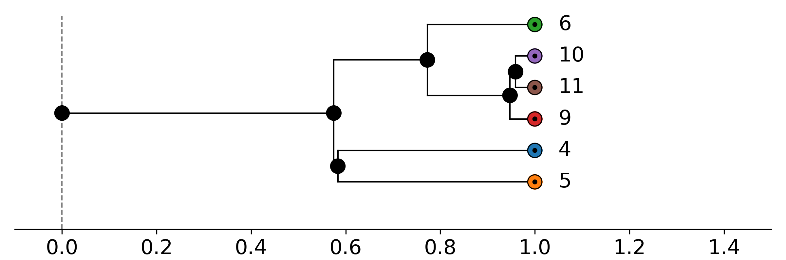
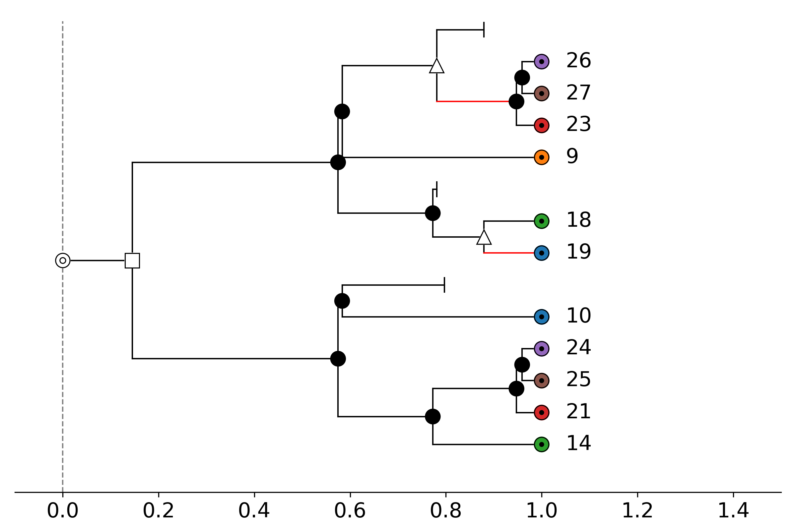
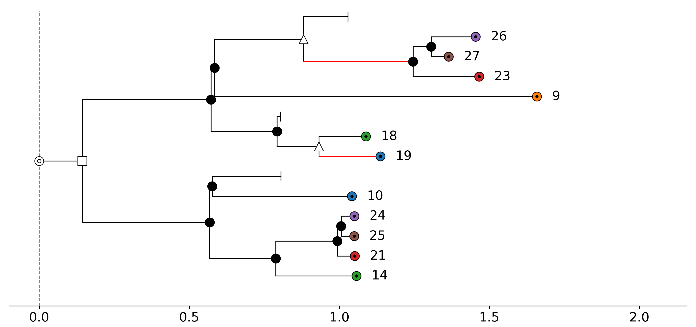
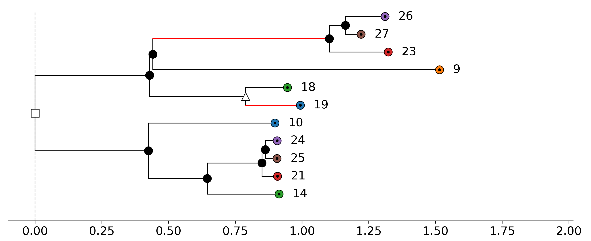

# Tree visualization

The function `visualize(tree, color_dict=None, save_as=False)` in the module
`asymmetree.visualization.tree_vis` uses matplotlib to draw a simulated species or gene tree.
The `color_dict` parameter can be used to specify the colors of the (non-loss) leaves, and `save_as`
is used to specify a filename to save the figure as a PDF. If `save_as` is set to `False`, the
figure will be displayed instead of being saved.

The function `assign_colors(species_tree, gene_tree)` of the module takes two trees as input and
assigns to each non-loss species leaf a unique color and to each non-loss gene the assigned color
of the species to which this gene belongs.

Example usage:

```python
import asymmetree.treeevolve as te
from asymmetree.visualization.tree_vis import visualize, assign_colors

S = te.species_tree_n_age(6, 1.0)

# dated gene tree (with losses)
dated_gene_tree = te.dated_gene_tree(
    S,
    dupl_rate=0.5,
    loss_rate=0.5,
    hgt_rate=0.5,
)
full_gene_tree = te.rate_heterogeneity(
    dated_gene_tree,
    S,
    base_rate=1.0,
    autocorr_variance=0.1,
    rate_increase=('gamma', 0.5, 2.2),
    inplace=False,
)

# pruned gene tree
pruned_gene_tree = te.prune_losses(full_gene_tree)

# assign colors and visualize
species_colors, gene_colors = assign_colors(S, dated_gene_tree)
visualize(S, color_dict=species_colors, save_as='S.pdf')
visualize(dated_gene_tree, color_dict=gene_colors, save_as='T1.pdf')
visualize(full_gene_tree, color_dict=gene_colors, save_as='T2.pdf')
visualize(pruned_gene_tree, color_dict=gene_colors, save_as='T3.pdf')
```

**Species tree:**



**Dated gene tree (with losses):**



**Full gene tree (with losses and rate heterogeneity):**



**Pruned gene tree (with losses pruned):**


