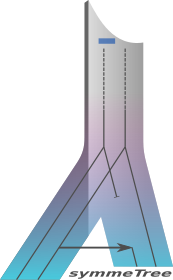

# AsymmeTree



AsymmeTree is an open-source Python library for the simulation and analysis of phylogenetic
scenarios. It includes a simulator for species and gene trees with heterogeneous evolution rates,
nucleotide and amino acid sequences with or without indels, as well as whole genomes/proteomes.

Moreover, it includes a matplotlib-based visualization of the simulated trees as well as tools for
the extraction of information from the simulated scenarios such as orthology, best matches, and
xenology.

The library is primarily designed to explore and validate mathematical concepts, and to test
inference methods for various steps on the way to more realistically-available data, i.e., dated
gene trees, additive distances of gene sets, noisy distances and finally sequences.

## Quick start

```bash
pip install asymmetree
```

```python
import asymmetree.treeevolve as te

# simulate a species tree with 10 leaves
species_tree = te.species_tree_n(10)
```

See the [User Guide](guide/index.md) for a full walkthrough, or jump straight to the
[API Reference](api/treeevolve.md).
